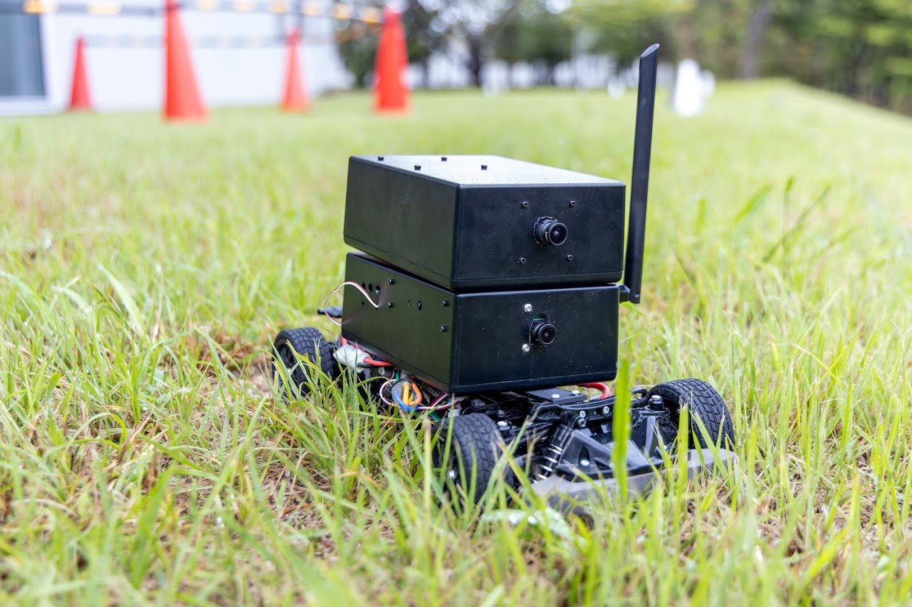
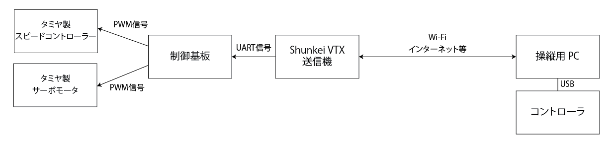

# ShunCar

ShunCarは、 [低遅延映像伝送システム Shunkei VTX](https://www.shunkei.jp/product/) を活用した遠隔操縦の評価のためのラジコンです。

タミヤ製のラジコン TT-02 をベースにデジタル操縦仕様に改造したものであり、
Shunkei VTX以外でも、UART信号を出力できるシステムを構築すれば操縦が可能です。

※ 画像は開発中のバージョンです。

## 構成

- 制御基板
    - Shunkei VTXからUART信号を受け取り、タミヤ製ESCを制御するPWM信号を生成する基板です。
    - Raspberry Pi Picoを用いて制御を行っています。
- Shunkei VTX送信機
    - Shunkei VTX送信機はUARTポートを持っており、接続された機器へネットワーク越しに信号を入力する機能を持っています。
    - 今回の構成では、Shunkei VTXから制御基板へ信号を入力しています。
- 操縦用PC
    - 操縦用PCでは、USB接続したコントローラの入力をもとに、Shunkei VTXへネットワーク越しに信号を送り、制御基板を制御します。
    - 制御用のPythonスクリプトを実行します。スクリプトは `pc` ディレクトリに配置されています。
    - Shunkei VTXの制御には [Shunkei SDK for Python](https://github.com/shunkei-jp/shunkei_sdk_python/) を利用しています。

## お問い合わせ

質問・バグ報告・活用事例の報告などは、[Shunkei Github discussions](https://github.com/orgs/shunkei-jp/discussions) へご投稿ください。
機能追加に関する要望や検討中の利用事例なども投稿いただければ、今後の開発方針に参考にさせていただきます。

公開したくないお問い合せは [お問い合わせフォーム](https://docs.google.com/forms/d/e/1FAIpQLSdW6nHX65omXpBzfH-S1-7y5yRUXsz7jtYAO0YHv2naIvSpBg/viewform) までお寄せください。

## ToDo

- [ ] 制御基板の回路データの公開
- [x] 制御基板用Raspberry Pi Picoのファームウェアの公開
- [x] 追加パーツの3Dモデルの公開
- [ ] ドキュメントの公開

