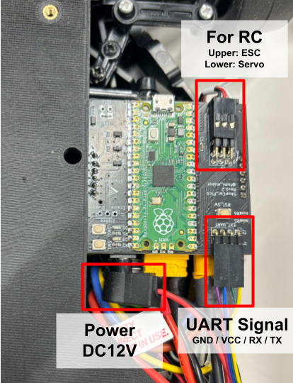
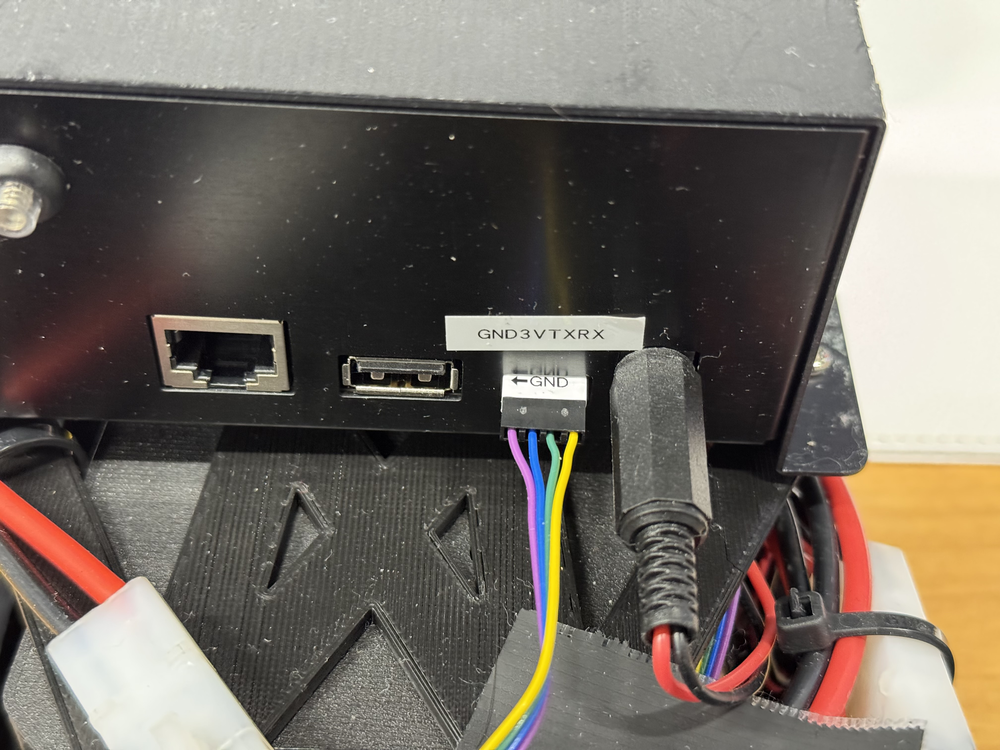

# ShunCar利用マニュアル

ShunCarとShunkei VTX送信機を接続します。

電源ケーブルと通信ケーブルを接続する必要があります。
Shunkei VTX送信機の電源は、2.1mmのDCジャックを用いて行います。
また、制御用のシリアル通信は、4ピンのケーブルを用いて行います。

## ケーブルの接続

ケーブルの順番
ShunCarに乗っている基板のピン配置は以下の通りです。

Shunkei VTX送信機のピン配置は以下の通りです。

これらに対応するように、電源ケーブルと通信ケーブルを接続します。

## 起動

ShunCarにバッテリーを接続し、Shunkei VTX送信機の電源ボタンを押して電源を入れます。

Shunkei VTXの設定に関しては、
[Shunkei VTX ドキュメント](https://docs-vtx.shunkei.jp/)
を参照してください。

## 操縦プログラムの起動

[pc/README.md](pc/README.md) に従って操縦プログラムをセットアップし、起動します。
